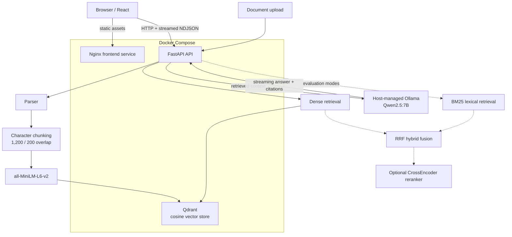

# AI Engineering Lab / RAG Platform

## Overview

This repository contains a local-first Retrieval-Augmented Generation (RAG) platform
for uploading documents and asking grounded questions about their contents. It combines
a React interface, a FastAPI service, Qdrant vector search, SentenceTransformers
embeddings, and a locally served Ollama model. Answers stream to the browser with the
source chunks used as context.

The project also treats retrieval as a measurable subsystem. A shared 20-question
benchmark compares dense retrieval, BM25 + dense rank fusion, and cross-encoder
reranking without changing the production answer path.

## Architecture



The production `/search`, `/ask`, and `/ask/stream` endpoints use the dense path.
Hybrid retrieval and reranking remain isolated, comparable evaluation modes. See
[the architecture notes](docs/architecture.md) for component responsibilities and
design rationale.

## Retrieval Strategy

- **Dense semantic search** embeds the query with
  `sentence-transformers/all-MiniLM-L6-v2` and searches Qdrant using cosine
  similarity. It is the stable production baseline.
- **BM25 lexical search** rewards exact term overlap and complements semantic search
  on identifiers and fact-heavy queries.
- **Hybrid RRF** combines dense and BM25 ranks using Reciprocal Rank Fusion (`k=60`),
  without requiring their incompatible raw scores to share a scale.
- **Reranking** applies `cross-encoder/ms-marco-MiniLM-L-6-v2` to the fused candidate
  set for better top-rank ordering at additional inference cost.

## Evaluation

All modes use the same 20 manually labeled, domain-specific questions and unchanged
`expected_chunk_ids`. The benchmark measures retrieval quality—not final LLM answer
quality, correctness, or faithfulness.

| Retrieval mode | Hit Rate@3 | Hit Rate@5 | Hit Rate@10 | MRR |
|---|---:|---:|---:|---:|
| Dense | 0.85 | 0.85 | 0.90 | 0.7833 |
| Hybrid (dense + BM25 + RRF) | 0.90 | 1.00 | 1.00 | 0.8475 |
| Hybrid + reranker | 1.00 | 1.00 | 1.00 | 0.9750 |

Hybrid + reranker had approximately 85 ms median and 177.5 ms p95 total retrieval
latency in the recorded run; average reranking latency was approximately 102.8 ms.
Hardware and model-cache state affect latency. Methodology, failure analysis, and
reproduction details are in the [retrieval evaluation report](rag-platform/evals/README.md).

## Production Reliability

- `GET /health` reports API, Qdrant, and Ollama status without making dependency
  outages crash the service.
- Environment-backed centralized settings provide local defaults and bounded external
  service timeouts.
- Standard Python logging covers lifecycle, indexing, retrieval timing, and dependency
  failures without logging full documents or prompts.
- API errors use short structured responses rather than exposing stack traces.
- Docker Compose supplies health-aware service startup and a named volume for Qdrant
  persistence.

## Quick Start

### A. Docker Compose

Prerequisites: Docker with Compose, plus Ollama running on the host with
`qwen2.5:7b` available (`ollama list` verifies local models).

```bash
cd rag-platform
cp .env.example .env
docker compose up --build
```

- Frontend: <http://localhost:5173>
- API and OpenAPI docs: <http://localhost:8001> and <http://localhost:8001/docs>
- Health: <http://localhost:8001/health>
- Qdrant dashboard: <http://localhost:6333/dashboard>

The API container reaches Qdrant through the Compose network and host Ollama through
`host.docker.internal`. To stop the stack while retaining indexed data:

```bash
docker compose down
```

Do not add `-v` unless you intend to delete the Qdrant volume.

### B. Local Development

Run Qdrant and Ollama first. From the repository root, start Qdrant with:

```bash
docker compose -f rag-platform/docker-compose.yml up -d qdrant
```

Start the API:

```bash
cd rag-platform/backend
python3 -m venv .venv
source .venv/bin/activate
pip install -r requirements.txt
uvicorn app.main:app --reload --host 0.0.0.0 --port 8001
```

Start the frontend in another terminal:

```bash
cd rag-platform/frontend
npm install
npm run dev
```

## Configuration

Copy [`rag-platform/.env.example`](rag-platform/.env.example) to
`rag-platform/.env`. The `.env` file is ignored by Git; the example contains no
secrets.

| Variable | Default | Purpose |
|---|---|---|
| `QDRANT_HOST` / `QDRANT_PORT` | `localhost` / `6333` | Local Qdrant connection |
| `QDRANT_COLLECTION_NAME` | `documents` | Production chunk collection |
| `OLLAMA_BASE_URL` | `http://localhost:11434` | Ollama URL for local API runs |
| `OLLAMA_DOCKER_BASE_URL` | `http://host.docker.internal:11434` | Ollama URL inside Compose |
| `OLLAMA_MODEL` | `qwen2.5:7b` | Generation model |
| `RETRIEVAL_SCORE_THRESHOLD` | `0.35` | Dense retrieval baseline threshold |
| `EMBEDDING_MODEL` | `sentence-transformers/all-MiniLM-L6-v2` | Embedding model |
| `CHUNK_SIZE` / `CHUNK_OVERLAP` | `1200` / `200` | Character chunking parameters |
| `FRONTEND_ORIGIN` | `http://localhost:5173` | Allowed browser origin |
| `VITE_API_BASE_URL` | `http://localhost:8001` | Browser-visible API URL |
| `LOG_LEVEL` | `INFO` | Backend log verbosity |

Timeouts, ports, and seed-collection settings are also documented in the example file.

## Testing and Evaluation

Run from the repository root:

```bash
PYTHONPATH=rag-platform/backend \
  python3 -m unittest discover -s rag-platform/backend/tests -v

python3 -m unittest discover -s rag-platform/evals/tests -v

cd rag-platform/frontend
npm run build
npm run lint
```

The retrieval runner expects Qdrant to contain the corpus associated with the labels:

```bash
rag-platform/backend/.venv/bin/python \
  rag-platform/evals/run_retrieval_eval.py \
  --retrieval-mode dense

rag-platform/backend/.venv/bin/python \
  rag-platform/evals/run_retrieval_eval.py \
  --retrieval-mode hybrid \
  --candidate-pool 50 \
  --rrf-k 60

rag-platform/backend/.venv/bin/python \
  rag-platform/evals/run_retrieval_eval.py \
  --retrieval-mode hybrid-rerank \
  --candidate-pool 50 \
  --rrf-k 60 \
  --rerank-candidates 20
```

## Demo Scenarios

1. Upload a supported document, ask a question whose answer is present, and inspect
   the cited filename, chunk index, retrieval score, and streamed response.
2. Ask an out-of-domain question and demonstrate that the `0.35` relevance threshold
   prevents unsupported answer generation when no chunk qualifies.
3. Run dense, hybrid, and hybrid-rerank evaluation modes against the same labels and
   discuss the measured quality/latency trade-off. The UI itself remains dense-only.

## Trade-offs and Known Limitations

- The production answer path remains dense retrieval; benchmarked hybrid/reranking
  stages are evaluation utilities.
- Ollama and its model lifecycle are host-managed rather than part of Compose.
- The benchmark covers 20 questions over one document corpus, so its results should
  not be generalized beyond that set.
- There is no end-to-end evaluation of generated-answer correctness or faithfulness.
- There is no PostgreSQL/application-state layer, authentication, or multi-user
  isolation.
- Chunking is character-based, and scanned documents may require separate OCR.
- First use of the embedding or reranker model may require a download and warm-up;
  subsequent use can rely on the local model cache.

## What This Project Demonstrates

- End-to-end RAG architecture and grounded, streaming generation
- Vector retrieval and Qdrant payload/identity design
- Semantic versus lexical retrieval trade-offs
- Reciprocal Rank Fusion and cross-encoder reranking
- Labeled retrieval evaluation and latency/quality analysis
- FastAPI service boundaries, errors, health checks, and timeouts
- Docker service networking and persistent vector storage
- Local LLM serving with Ollama
